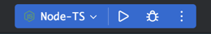

# Typescript Get Started

## 项目命名

本项目的文件夹命名应当遵循于 [Javascript@wangdoc](https://wangdoc.com/javascript/)

## 运行

文章地址 : [Create a custom Node.js run/debug configuration for ts-node](https://www.jetbrains.com/help/webstorm/running-and-debugging-typescript.html#ws_ts_run_debug_directly_ceate_node_config)

**安装 typescript/ts-node**

```
$ npm install --save-dev ts-node
$ npm install --save-dev typescript
```

**创建配置**

1. 选择 `Run | Edit Configurations` , 在编辑配置中, 点击 + , 选择 Node.js
2. 在 Node Parameters 参数内添加 `--require ts-node/register`
3. 在参数栏中添加 `$FilePathRelativeToProjectRoot$`, 添加参数栏, 如图


这样打开 ts 文件之后, 便可以在右上角运行



## 相关文档

- [Javascript](https://wangdoc.com/javascript/)
- [JEST](https://jestjs.io/zh-Hans/docs/getting-started)
- [Typescript](https://www.typescriptlang.org/docs/)
- [ES6](https://wangdoc.com/es6/)
